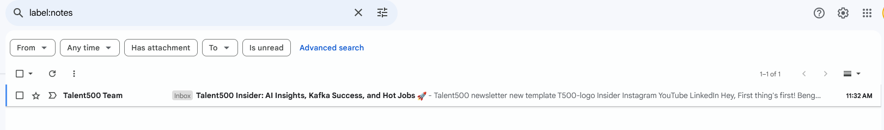

Rule:

```json
[
  {
    "conditions": [
      {"field": "received_date", "predicate": "less than", "value": {"date": "2024-12-09", "unit": "days", "value": 7}},
      {"field": "Subject", "predicate": "Does not Contain", "value": "Meeting"}
    ],
    "predicate": "All",
    "actions": [
      {"action": "Mark as unread"},
      {"action": "Move Message", "destination": "Notes"}
    ]
  }
]
```

# Rule Example

## Rule Definition

### Conditions:
- **Received Date**: The email's `received_date` is checked to be less than 7 days old compared to "2024-12-09".
- **Subject**: The `Subject` field is verified to **not** contain the word "Meeting".

### Predicate:
- **All** conditions must be true for the rule to apply.

### Actions:
- The email is marked as **unread**.
- The email is moved to the "**Notes**" label/folder.

---

### Before:
The email is already opened and marked as read.


### After:
The email is moved to the "Notes" label and marked as unread.



---

### Explanation:
This rule ensures that any email received in the past 7 days without the word "Meeting" in the subject will be automatically moved to the "Notes" folder and marked as unread.
