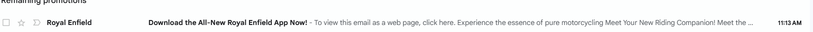
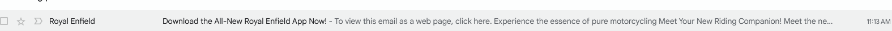

Rule:

```json
[
  {
    "conditions": [
      {"field": "From", "predicate": "Contains", "value": "royalenfield"},
      {"field": "Subject", "predicate": "Does not Contain", "value": "newsletter"}
    ],
    "predicate": "Any",
    "actions": [
      {"action": "Mark as read"}
    ]
  }

]
```
# Rule Example

## Rule Definition

### Conditions:
- **From**: The email’s `From` field contains "royalenfield".
- **Subject**: The `Subject` field does **not** contain the word "newsletter".

### Predicate:
- **Any** condition must be true for the rule to apply.

### Actions:
- The email is marked as **read**.

---

### Before:
The email is unopened and in the inbox.



### After:
The email is marked as read.



---

### Explanation:
This rule ensures that any email from "royalenfield" without the word "newsletter" in the subject will be automatically marked as read.
